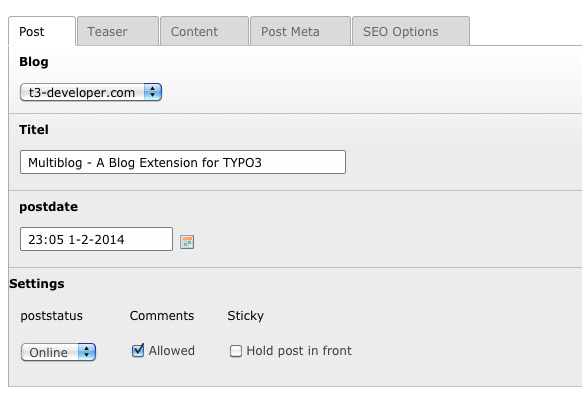
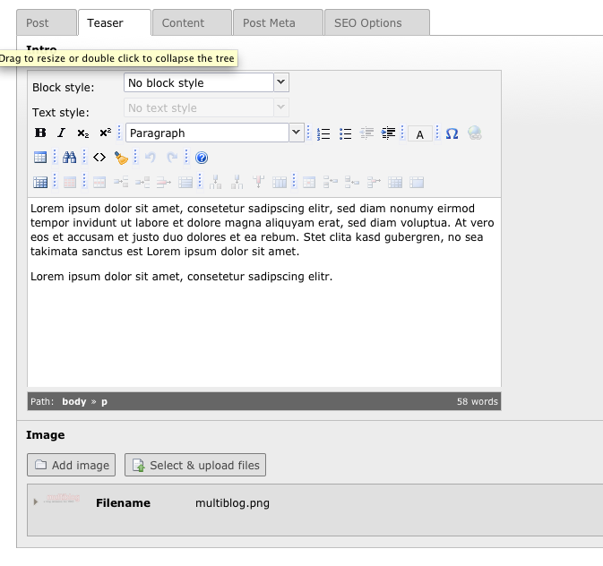
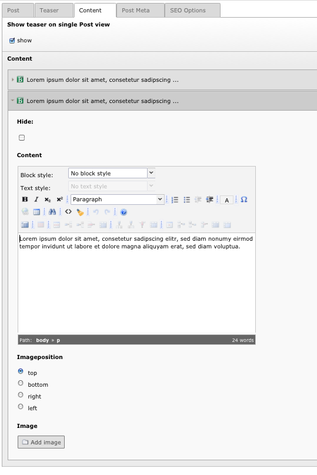

.. ==================================================
.. FOR YOUR INFORMATION
.. --------------------------------------------------
.. -*- coding: utf-8 -*- with BOM.

.. include:: ../Includes.txt

==============================
Start Blogging
==============================

Add a Post in the list view of the storage folder

In general a post contains a teaser and several contet elements. 
The post teaser is displayed on the list views like the blog startpage and category lists and optinonal on the single post page. 
You can add ONE image to the teaser and each content elements.

		