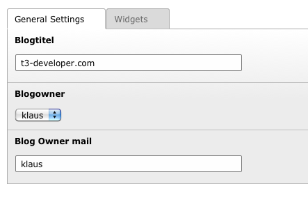
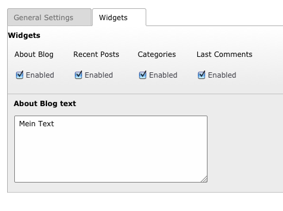

.. ==================================================
.. FOR YOUR INFORMATION
.. --------------------------------------------------
.. -*- coding: utf-8 -*- with BOM.

.. include:: ../Includes.txt

==============================
Setup a Blog
==============================

* Create a Frontend Usergroup and User in the storage folder of the blog.
* Add a blog in the list view of the storage folder
* Add some categories in the list view of the storage folder

Blogoptions
~~~~~~~~~~~

	

	