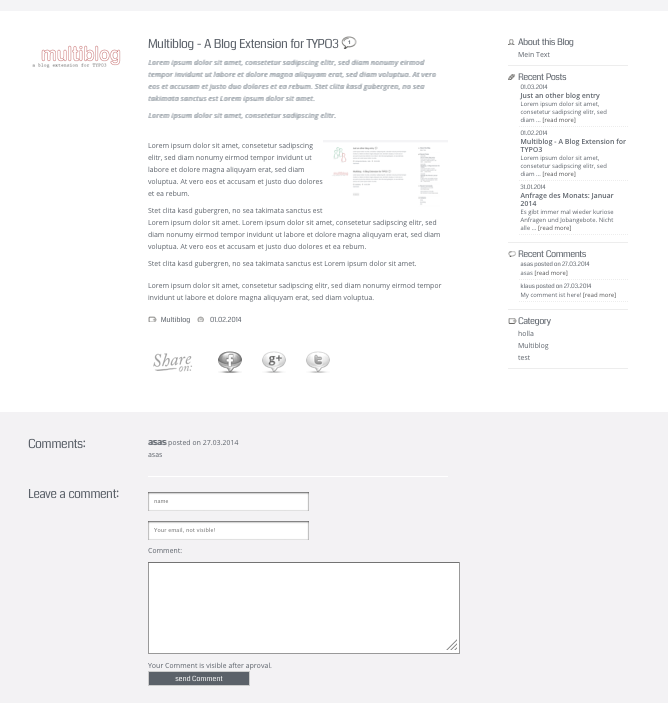
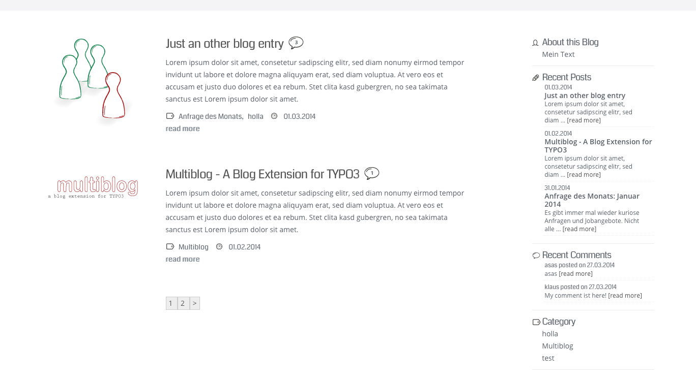

..  Editor configuration
	...................................................
	* utf-8 with BOM as encoding
	* tab indent with 4 characters for code snippet.
	* optional: soft carriage return preferred.

.. Includes roles, substitutions, ...
.. include:: _IncludedDirectives.rst

=================
Extension Name
=================

:Extension name: Multiblog
:Extension key: multiblog
:Version: 1.0
:Description: A Blog Extension for TYPO3. Including Commentsystem, Social Sharing. Works with TYPO3 6.1 and 6.2
:Language: en
:Author: Klaus Heuer
:Creation: 2014-02-19
:Generation: 09:17
:Licence: Open Content License available from `www.opencontent.org/opl.shtml <http://www.opencontent.org/opl.shtml>`_

The content of this document is related to TYPO3, a GNU/GPL CMS/Framework available from `www.typo3.org
<http://www.typo3.org/>`_

**Table of Contents**

.. toctree::
	:maxdepth: 2

	ProjectInformation
	UserManual
	AdministratorManual
	TyposcriptReference
	DeveloperCorner
	RestructuredtextHelp

.. STILL TO ADD IN THIS DOCUMENT
	@todo: add section about how screenshots can be automated. Pointer to PhantomJS could be added.
	@todo: explain how documentation can be rendered locally and remotely.
	@todo: explain what files should be versionned and what not (_build, Makefile, conf.py, ...)

.. include:: ../Readme.rst

What does it do?
=================

Multiblog is an easy to use blogsystem whith several widgets and social sharing function.

Screenshot of a single post
----------------------------

		
Screenshot of the blog view
----------------------------

		