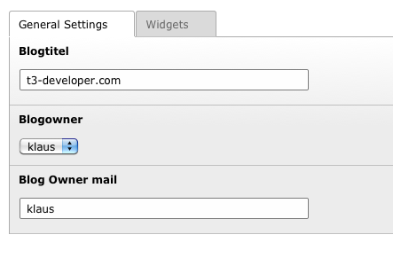
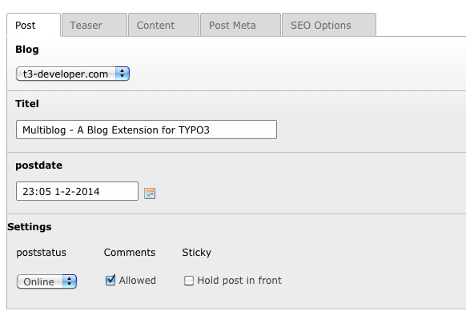
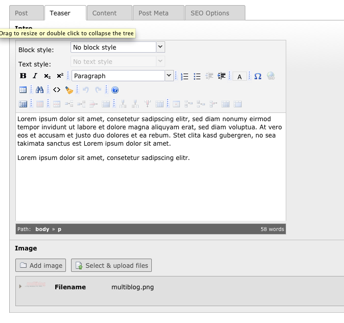
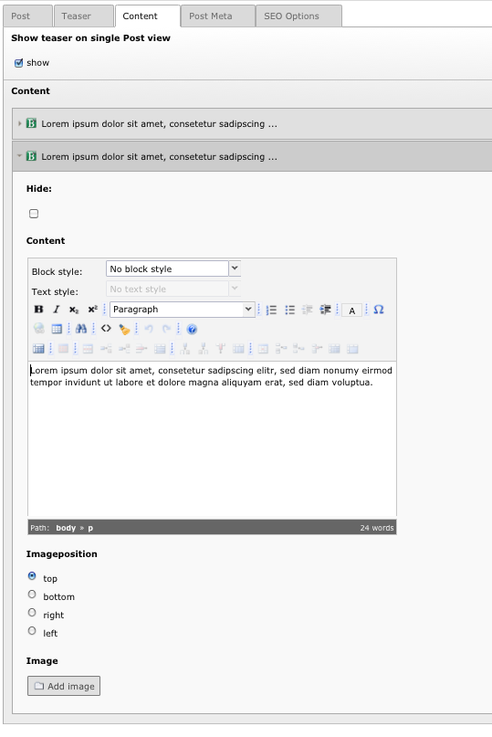

============
Users manual
============

Setup:
---------
* Install the extension an set the storage folder PID in the constant editor of the template.
* Insert the Blog plugin on a full-width page.
* Create a Frontend Usergroup and User in the storage folder of the blog.
* Add a blog in the list view of the storage folder
* Add some categories in the list view of the storage folder
* Add a Post in the list view of the storage folder

Its recommended to use realURL for correct writing of the post links. In the folder multiblog/realURL_config is a sample configuration for writing URLs like www.myweb.com/this-is-my-post.

Blogoptions
~~~~~~~~~~~

.. figure:: Images/BE_screen_02.png
		:width: 200px
		:alt: Backend view		

Writing a Post
~~~~~~~~~~~

FAQ
====

none
