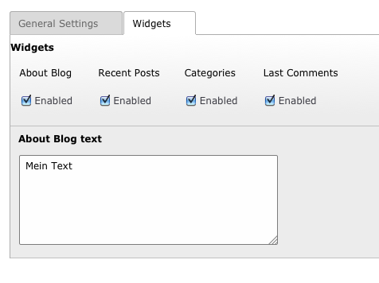

============
Users manual
============

Setup:
---------
* Install the extension an set the storage folder PID in the constant editor of the template.
* Insert the Blog plugin on a full-width page.
* Make shure that you don't render a title tag oder meta tags on the page with the blog plugin. This is done by the extension.
* Add to the page typoscript of your storage folder: TCEMAIN.clearCacheCmd = PID of the Blogplugin

* Create a Frontend Usergroup and User in the storage folder of the blog.
* Add a blog in the list view of the storage folder
* Add some categories in the list view of the storage folder
* Add a Post in the list view of the storage folder

It's recommended to use realURL for correct writing of the post links. You can find a sample configuration for writing URLs like www.myweb.com/this-is-my-post in the folder multiblog/realURL_config.

Blogoptions
~~~~~~~~~~~

.. figure:: Images/BE_screen_01.png
		:width: 200px
		:alt: Backend view

Writing a Post
~~~~~~~~~~~

.. figure:: Images/BE_screen_04.png
		:width: 200px
		:alt: Backend view

FAQ
====

Images: You can add to the post teaser or each content section of a post one image only. 

Facebook sharing: For a correct sharing the page must indexed by facebook. You can do this manually, just submit your pagelink of a single post on https://developers.facebook.com/tools/debug/
